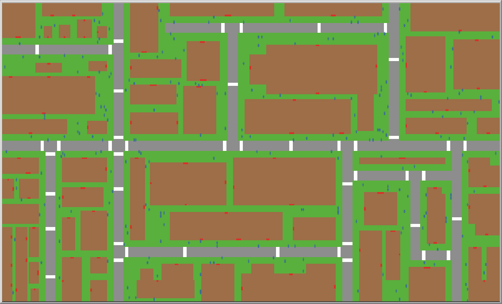

# ABM Pedestrian Simulation

A multi-agent pedestrian simulation model implemented in NetLogo, featuring heterogeneous agent behaviors and studying the emergence of crowd dynamics in urban environments.

## Overview

This project was developed as part of the **"Modeling and Simulation of Systems"** course during my Master of Science degree in Machine Learning and Artificial Intelligence at **AGH University of Science and Technology**.

The simulation explores how individual differences in pedestrian behavior (referred to as "personalities") affect the overall dynamics of crowd movement in typical urban street environments. By implementing Agent-Based Modeling (ABM) principles, the project demonstrates how microscopic interactions between heterogeneous agents lead to emergent macroscopic patterns in pedestrian flow.

## Objectives

- **Primary Goal**: Investigate the impact of behavioral heterogeneity on pedestrian flow dynamics in urban environments
- **Key Research Questions**:
  - How do individual differences in walking speed, patience, and density sensitivity affect global traffic patterns?
  - What emergent behaviors arise from local interactions between heterogeneous pedestrians?
  - How does agent diversity influence congestion formation and system throughput?

## System Architecture

### Environment
- **Grid-based simulation**: 300×180 cell environment loaded from text files
- **Urban infrastructure elements**:
  - `D` (Doors) - Goal areas for agents (red)
  - `S` (Sidewalks) - Walkable areas where agents spawn (green)
  - `C` (Crossings) - Pedestrian crossings (white)
  - `B` (Buildings) - Obstacles (brown)
  - `R` (Roads) - Non-walkable areas (gray)

*Example simulation showing 250 agents navigating the urban environment with different personality traits*

### Agent Characteristics
Each pedestrian agent possesses unique "personality" traits:
- **`desired-speed`**: Preferred walking velocity
- **`patience`**: Tolerance for waiting when blocked
- **`density-sensitivity`**: Responsiveness to nearby agent density
- **`avoidance-radius`**: Perception range for obstacles and other agents
- **`wiggle-angle`**: Natural movement variation

### Behavioral Algorithms
- **Pathfinding**: Breadth-First Search (BFS) algorithm for route planning
- **Collision Avoidance**: Multi-strategy approach including turning, waiting, and route recalculation
- **Goal Management**: Dynamic goal assignment with respawn mechanics
- **Adaptive Movement**: Speed adjustment based on local density and personality traits

## Getting Started

### Prerequisites
- NetLogo 6.4.0 or later
- Python 3.x (for map conversion utilities)
- PIL/Pillow library for image processing

### Running the Simulation
1. Open NetLogo and load `src/sim.nlogo`
2. Click "Setup" to initialize the environment and agents
3. Adjust simulation parameters using the interface sliders:
   - Number of agents
   - Personality trait ranges (speed, patience, etc.)
4. Click "Go" to start the simulation

### Custom Maps
Custom maps can be created in any graphical editor and then converted to .txt map using `map_converter.py` utility.
Map colors:
- Red (#FF0000) → Doors/Goals
- Green (#9BD08A) → Sidewalks
- White (#FFFFFF) → Crossings
- Brown (#61442C) → Buildings
- Gray (#8D8D8D) → Roads